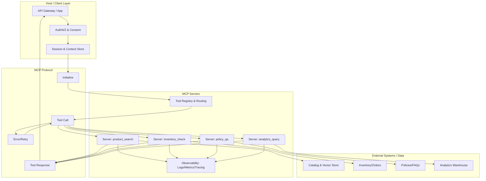

# MCP Architecture Diagram: Retail RAG System Tool Integration (Mermaid)

```mermaid
flowchart TB
  subgraph Host[Host / Client Layer]
    GW[API Gateway / App]
    AUTH[AuthN/Z & Consent]
    SESS[Session & Context Store]
  end

  subgraph Protocol[MCP Protocol]
    INIT[Initialize]
    CALL[Tool Call]
    RESP[Tool Response]
    ERR[Error/Retry]
  end

  subgraph Servers[MCP Servers]
    REG[Tool Registry & Routing]
    SRV1[Server: product_search]
    SRV2[Server: inventory_check]
    SRV3[Server: policy_qa]
    SRV4[Server: analytics_query]
    LOG[Observability: Logs/Metrics/Tracing]
  end

  subgraph Data[External Systems / Data]
    CAT[Catalog & Vector Store]
    INV[Inventory/Orders]
    POL[Policies/FAQs]
    DWH[Analytics Warehouse]
  end

  GW --> AUTH --> SESS --> INIT --> REG
  REG --> CALL --> SRV1 & SRV2 & SRV3 & SRV4
  SRV1 --> CAT
  SRV2 --> INV
  SRV3 --> POL
  SRV4 --> DWH
  SRV1 & SRV2 & SRV3 & SRV4 --> RESP --> GW
  SRV1 & SRV2 & SRV3 & SRV4 --> LOG
  CALL --> ERR --> CALL
```
