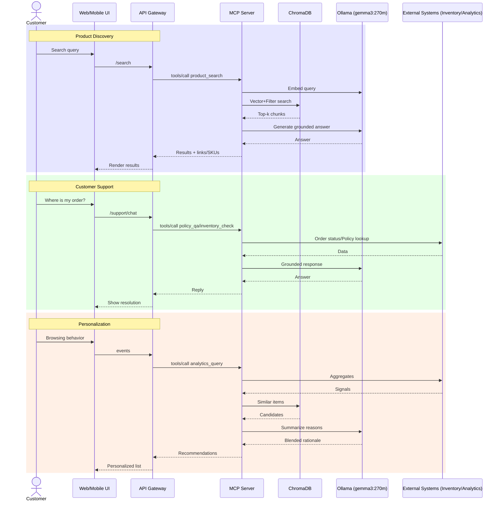

# Use Case Interaction Flows: Customer Journeys (Mermaid)

```mermaid
sequenceDiagram
  actor C as Customer
  participant UI as Web/Mobile UI
  participant API as API Gateway
  participant MCP as MCP Server
  participant DB as ChromaDB
  participant O as Ollama (gemma3:270m)
  participant EXT as External Systems (Inventory/Analytics)

  rect rgb(230,230,255)
  Note over C,API: Product Discovery
  C->>UI: Search query
  UI->>API: /search
  API->>MCP: tools/call product_search
  MCP->>O: Embed query
  MCP->>DB: Vector+Filter search
  DB-->>MCP: Top-k chunks
  MCP->>O: Generate grounded answer
  O-->>MCP: Answer
  MCP-->>API: Results + links/SKUs
  API-->>UI: Render results
  end

  rect rgb(230,255,230)
  Note over C,API: Customer Support
  C->>UI: Where is my order?
  UI->>API: /support/chat
  API->>MCP: tools/call policy_qa/inventory_check
  MCP->>EXT: Order status/Policy lookup
  EXT-->>MCP: Data
  MCP->>O: Grounded response
  O-->>MCP: Answer
  MCP-->>API: Reply
  API-->>UI: Show resolution
  end

  rect rgb(255,240,230)
  Note over C,API: Personalization
  C->>UI: Browsing behavior
  UI->>API: events
  API->>MCP: tools/call analytics_query
  MCP->>EXT: Aggregates
  EXT-->>MCP: Signals
  MCP->>DB: Similar items
  DB-->>MCP: Candidates
  MCP->>O: Summarize reasons
  O-->>MCP: Blended rationale
  MCP-->>API: Recommendations
  API-->>UI: Personalized list
  end
```
