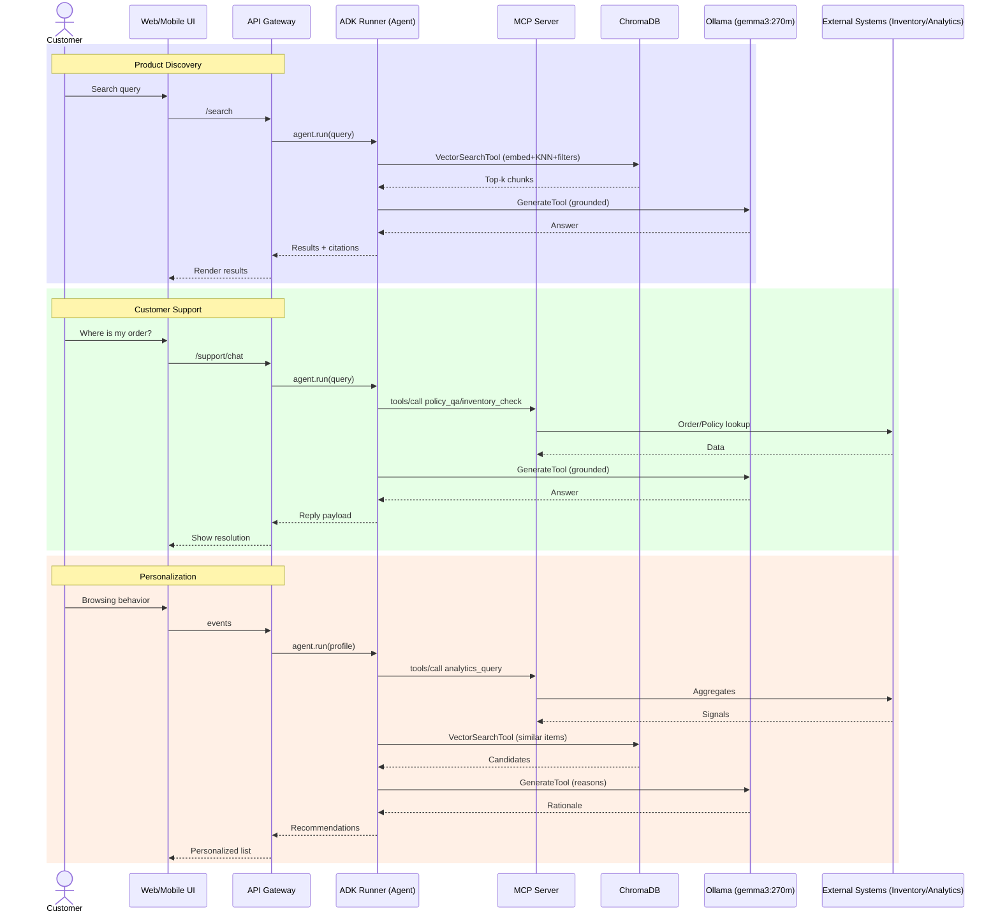

# Use Case Interaction Flows: Customer Journeys (Mermaid, with ADK Runner)

```mermaid
sequenceDiagram
  actor C as Customer
  participant UI as Web/Mobile UI
  participant API as API Gateway
  participant ADK as ADK Runner (Agent)
  participant MCP as MCP Server
  participant DB as ChromaDB
  participant O as Ollama (gemma3:270m)
  participant EXT as External Systems (Inventory/Analytics)

  rect rgb(230,230,255)
  Note over C,API: Product Discovery
  C->>UI: Search query
  UI->>API: /search
  API->>ADK: agent.run(query)
  ADK->>DB: VectorSearchTool (embed+KNN+filters)
  DB-->>ADK: Top-k chunks
  ADK->>O: GenerateTool (grounded)
  O-->>ADK: Answer
  ADK-->>API: Results + citations
  API-->>UI: Render results
  end

  rect rgb(230,255,230)
  Note over C,API: Customer Support
  C->>UI: Where is my order?
  UI->>API: /support/chat
  API->>ADK: agent.run(query)
  ADK->>MCP: tools/call policy_qa/inventory_check
  MCP->>EXT: Order/Policy lookup
  EXT-->>MCP: Data
  ADK->>O: GenerateTool (grounded)
  O-->>ADK: Answer
  ADK-->>API: Reply payload
  API-->>UI: Show resolution
  end

  rect rgb(255,240,230)
  Note over C,API: Personalization
  C->>UI: Browsing behavior
  UI->>API: events
  API->>ADK: agent.run(profile)
  ADK->>MCP: tools/call analytics_query
  MCP->>EXT: Aggregates
  EXT-->>MCP: Signals
  ADK->>DB: VectorSearchTool (similar items)
  DB-->>ADK: Candidates
  ADK->>O: GenerateTool (reasons)
  O-->>ADK: Rationale
  ADK-->>API: Recommendations
  API-->>UI: Personalized list
  end
```
