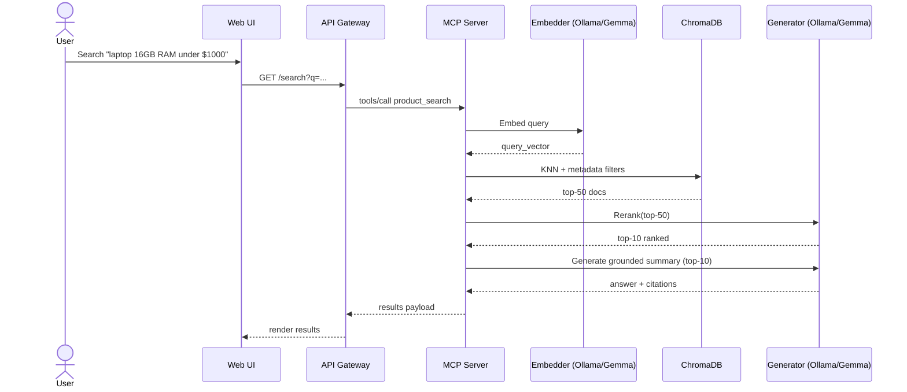
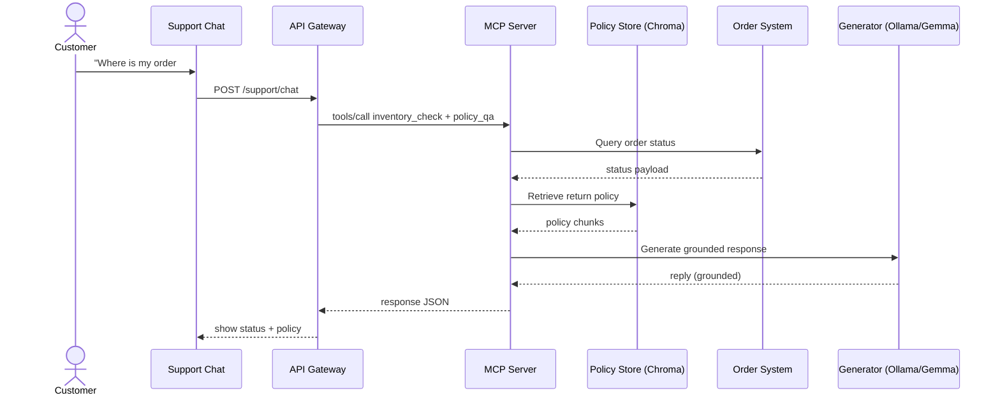
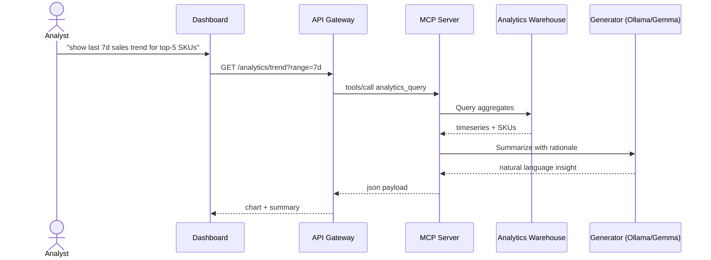

# Sequence Diagrams (Mermaid)

This document contains additional detailed sequence diagrams for critical flows.

## 1) Product Discovery with Hybrid Retrieval and Reranker

## 2) Customer Support with Policy Guardrails

## 3) Analytics Insight Summary (Read-only)

